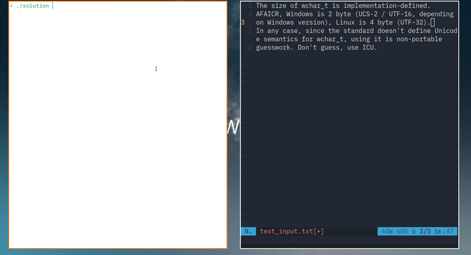

# Решение задачи для поступления на кафедру 1С

## Задача

“Тайный шифр”.

В огромном тексте содержится тайный шифр. Чтобы его прочитать, необходимо взять слово-ключ (которое может быть самым разным, но не превышает по длине пяти букв) и найти последовательность из нескольких слов таких, что первая буква первого слова, вторая -- второго, третья -- третьего и так далее будут образовывать слово-ключ. Номер первого слова необходимо вывести.

Реализуйте структуру, которая принимает текст, обрабатывает его, а потом эффективно отвечает на запросы, возвращая номер первого слова по ключу. Слова разделены пробелами и переводами строк, символы не учитываются. Если подходящих последовательностей несколько, выведите любой из ответов.

Например, текст -- это задание, ключ -- “чек”, ответ -- 31

Текст представляет из себя .txt - файл размером до 2ГБ, а запросы и ответы на них должны вводиться/выводиться в консоль.

## Алгоритм решения

Задача разбита на несколько этапов:
* Разбиение входного файла на токены (слова) в классе `Tokenizer` в `inc/tokenizer.hpp`
* Поддержания скользящего окна из 5 токенов в классе `Decoder` в `inc/decoder.hpp`
* Вставка всех возможных ключей в этом окне в бор в классе `CodeTree` в `inc/code_tree.hpp`
* Нахождение позиции для ключа при помощи бора в классе `CodeTree`

### Демонстрация работы



### Уточнение

Решение работает с нижним регистром, автоматически переводя в него весь входной файл и ввод пользователя.

## Недостатки

### Локали

К сожалению, решение поддерживает только латиницу.

### Скорость

Тесты на больших файлах показали, что решение работает непростительно долго (около 150с на 300мб на ноутбуке автора). В ветке `mmap` была произведения попытка оптимизации токенайзера - применение mmap и ограничение сохраняемого размера токена. К сожалению, к большим результатам это не привело.

Другое направление оптимизации по мнению автора - замена бора на более простую структуру данных. Попытка заменить бор на хэш мап была произведена на ветке `unordered_map`. Это дало значительное ускорение, однако не позволило добиться приемлимых результатов.

## Сборка
```bash
mkdir build && cmake -Bbuild .
cd build && make
cd ..
```

## Запуск
```bash
./build/solution
Secret decoder
Usage: ./build/solution TEXT_FILE.txt
```

## Тесты

Автор не был уверен, можно ли использовать фреймоврки для тестирования, поэтому простой тест написан вручную.

### Запуск тестов
```bash
./build/tests
```
